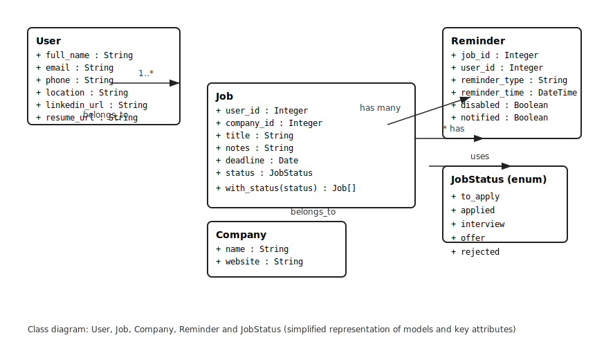

# README

Architecture:
# Job Tracker Application Architecture

This Markdown document describes the **monolithic architecture** and flow of the job tracker application.

---

## 1. Overall Architecture

```
+----------------------+     +----------------------+     +--------------------+
|  Web Browser / UI    | <-> |  Rails Controllers   | <-> |  Views / Templating |
|  (HTML/CSS/JS,       |     |  (Jobs, Users, Auth) |     |  (ERB/Haml, JS)     |
|  Stimulus)           |     |                      |     |                    |
+----------------------+     +----------+-----------+     +--------------------+
             |                          |
             | HTTP requests / Fetch/XHR
             v                          v
+----------------------+     +----------------------+
| Frontend Assets / JS | --> | Rails Controllers    |
| (Stimulus controllers,|     | (HTML endpoints,     |
|  packs, CSS, images)  |     |  JSON/API endpoints) |
+----------------------+     +----------+-----------+
             |                          |
             | client-side DOM updates  | reads / writes
             | or API calls to          v
             | controllers         +----------------------+
             +-------------------> | Models (ActiveRecord)|
                                | User, Job, Company   |
                                | Reminders, etc.      |
                                +----------------------+ 
                                         |
                                         v
                                +----------------------+
                                |  Database            |
                                |  (PostgreSQL)        |
                                +----------------------+
                                         |
                                         v
                                +----------------------+
                                | Background Jobs      |
                                | (ActiveJob — adapter)|
                                | -> External Services |
                                |    (Email, Slack API)|
                                +----------------------+
```
### 🧭 Architecture Decision Records (ADRs)

**Project:** Job Tracker  
**Course:** CSCE 606 – Software Engineering  
**Institution:** Texas A&M University  
**Team:** Group 6 (Fall 2025)  

---

#### 📘 Overview

Architecture Decision Records (ADRs) capture **important architectural and technical decisions** made throughout the lifecycle of the Job Tracker application.

Each ADR explains **what decision was made**, **why it was made**, **what alternatives were considered**, and **its consequences**.

> ADRs are numbered sequentially and stored under `/docs/architecture/`.

---

## 📂 ADR Index

| ADR # | Title | Summary |
|-------|--------|----------|
| [ADR-001](docs/ADR-001-monolithic-architecture.md) | **Monolithic Rails 8 Architecture** | Adopted a single Rails monolith for simplicity and Heroku compatibility. |
| [ADR-002](docs/ADR-002-authentication-devise.md) | **Authentication with Devise** | Chose Devise for secure, full-featured authentication and password recovery. |
| [ADR-003](docs/ADR-003-database-choice.md) | **Database Choice: PostgreSQL (Prod) + SQLite (Dev/Test)** | Used SQLite locally and PostgreSQL in production for compatibility and ease. |
| [ADR-004](docs/ADR-004-deployment-heroku.md) | **Deployment via Heroku with GitHub Actions CI/CD** | Selected Heroku for seamless Git-based deployment and CI/CD automation. |
| [ADR-005](docs/ADR-005-testing-frameworks.md) | **Testing Frameworks: RSpec + Cucumber** | Combined RSpec for unit/integration tests and Cucumber for acceptance testing. |
| [ADR-006](docs/ADR-006-csv-import-export.md) | **CSV Import/Export for Jobs** | Implemented CSV import/export for user data portability. |
| [ADR-007](docs/ADR-007-reminder-system.md) | **Reminder System Design** | Built a Reminder model tied to Jobs with status-based auto-disable logic. |
| [ADR-008](docs/ADR-008-ci-pipeline.md) | **Continuous Integration Pipeline** | Configured GitHub Actions to run RSpec, Cucumber, and Brakeman on each PR. |
| [ADR-009](docs/ADR-009-mailers.md) | **Mailers: SendGrid (Prod) + Letter Opener (Dev)** | Managed notifications using SendGrid. |
| [ADR-010](docs/ADR-010-frontend-choice.md) | **Frontend Implementation: ERB + Importmap** | Chose ERB templates and Importmap for a lightweight, build-free frontend. |


## Class Diagram

Below is a simplified class diagram showing the main models and relationships used in the application. (Rendered SVG included in the repo.)


---

## 2. Components

### 2.1 Frontend
- HTML/CSS/JS using Rails templating (ERB or Haml).
- Pages:
  - Landing Page
  - Sign Up / Login
  - User Profile
  - Job List / Status Board
  - Job Detail / Create/Edit
  - Reminders / Notifications
  - Import/Export Jobs
- Responsive design (desktop + mobile).

### 2.2 Backend
- **Controllers** handle HTTP requests and coordinate with models.
- **Models** manage database interactions (ActiveRecord): User, Job, Reminder, Company.
- **Background Jobs** handle:
  - Sending Email notifications
  - Sending Slack messages
  - CSV import/export
- **Services / Helpers** for parsing external job posts and integrations.

### 2.3 Database
- PostgreSQL (or MySQL) for storing:
  - Users
  - Jobs
  - Reminders
  - Notifications
  - Activity logs

### 2.4 External Integrations
- Email service (SMTP or SendGrid)
- Slack webhooks
- Optional external APIs for job import/export

### 2.5 CI/CD
- GitHub Actions for:
  - Running RSpec, Cucumber, Jasmine tests
  - Linting and code style checks
  - Automatic deployment to Heroku on `main` branch merge

### 2.6 Testing
- **RSpec** for unit and controller tests
- **Cucumber** for feature tests (behavior-driven)
- **Jasmine** for frontend JS tests
- All tests integrated into CI pipeline

---

## 3. User Request Flow

```
User (Browser)
    |
    v
HTTP Request -> Rails Router -> Controller -> Model -> DB
    |
    v
Controller returns data -> View renders -> Response to User
    |
    v
Background Jobs handle async tasks (Notifications / CSV Import)
``` 

---

## 4. Notes
- Monolithic structure keeps frontend, backend, and DB tightly integrated.
- Use partials and layouts for reusable UI components.
- Background jobs allow async processing for notifications.
- CI/CD ensures consistent builds and automatic deployments.
- The architecture supports incremental development (3 increments).

---
# Feature By Feature Documentation
## 1. User Authentication System

This section outlines the core user authentication system, built using the powerful **Devise** gem. It handles everything from creating an account to recovering it securely.

---

### 1.1 User Registration

New users can create a secure account to access the application's features. The registration process includes robust server-side validations to ensure data integrity and security.

#### **Sign-Up Form Fields:**

* **Full Name**: The user's full name is required.
* **Email**: A valid email address is required for registration and communication, such as password resets.
* **Phone**: A valid phone number (10-15 digits, country code optional) is required.
* **Profile Photo**: Users can upload a profile photo. The image must be a JPG or PNG and cannot exceed 2MB in size.
* **Password**: To enhance security, passwords must meet the following criteria:
  * Be at least **8 characters** long.
  * Contain at least **one uppercase letter** (A-Z).
  * Contain at least **one lowercase letter** (a-z).
  * Contain at least **one digit** (0-9).
  * Contain at least **one special character** (e.g., !, @, #, $).
* **Password Confirmation**: Users must re-enter their password to prevent typos.

Upon successful sign-up, a new user record is created in the database.

---

### 1.2 User Login & Logout

Registered users can securely access their accounts.

* **Login**: Users can log in using their email and password.
  * ✅ Upon successful authentication, the user is redirected to their personal **dashboard**.
* **Logout**: Users can log out to securely end their session, ensuring their account remains private.

---

### 1.3 Password Reset 🔑

Users who forget their password can easily and securely regain access to their account.

* **Request a Reset**: The user enters their email address on the "Forgot Password" page.
* **Email Notification**: An email containing a secure, time-sensitive link is sent to the user's registered address.
* **Set New Password**: By following the link, the user is taken to a page where they can set a new password that meets the application's security requirements.
* **Confirmation**: After successfully resetting the password, a confirmation message is shown, and the user can log in with their new credentials.


### 1.4 Edit Profile Functionality
The Edit Profile feature allows users to update their personal information, ensuring that their profile remains current. Users can update details such as their full name, contact information, location, LinkedIn URL, resume URL, profile photo, email, and password.

Users can edit the following fields:
1. Full name
2. Phone number
3. Location
4. LinkedIn URL
5. Resume URL
6. Profile photo
7. Email
8. Password

All changes persist in the database immediately after submission.  Updated information is displayed on the profile page without delay. Password updates require the current password for confirmation.

If email changes are made and the app uses Devise confirmable, pending reconfirmation is handled correctly.
File uploads for the profile photo only accept JPEG and PNG formats.

Validations are applied:
1. Minimum password length (if changing password)
2. Valid email format
3. Optional URL format for LinkedIn and Resume URLs

To do so, the following methodology has been used :
1. Create profile edit form
2. Render all editable fields in a form and display current values of each field.

We use Devise's registration_path for updating the user. We ensure updates persist to the database.

## 2. Jobs & Companies

This project provides a small Job Tracker with the following user-facing features and routes (concise):

- Jobs CRUD: create, read, update, delete job applications.
  - Routes: GET /jobs (index), GET /jobs/:id (show), GET /jobs/new, POST /jobs, GET /jobs/:id/edit, PATCH /jobs/:id, DELETE /jobs/:id
  - Redirects: creating a job currently redirects to the dashboard so users see new entries in context; editing/deleting will return to the dashboard if the action was initiated from the dashboard (tracked via params[:from] or referer), otherwise it returns to the jobs list (`jobs_path`).
- Search bar: the jobs list (`/jobs`) contains the search input (client-side filtering with Stimulus for live UI filtering). The search input is present for non-JS clients as well.
- Search bar: the jobs list (`/jobs`) contains the search input. By default the page uses client-side filtering (Stimulus) for instant, in-browser filtering. A non-JS fallback is provided: the search is also implemented as a GET form that submits a `q` query parameter to `GET /jobs` and the controller filters results server-side using `params[:q]` (case-insensitive, uses a left join on companies so jobs without a company are included).
- Company CRUD: create and list companies. Companies created from the job form return the user to the new-job form (uses `return_to: 'jobs_new'` or referer detection).

What lives where (important files):
- Jobs controller and views: `app/controllers/jobs_controller.rb`, `app/views/jobs/*`.
- Stimulus search controller: `app/javascript/controllers/job_search_controller.js` (client-side filtering of `#jobs-table`).
- Stimulus search controller: `app/javascript/controllers/job_search_controller.js` (client-side filtering of `#jobs-table`). The Stimulus controller now prevents the GET form from performing a full-page submit when JavaScript is enabled (so JS clients get instant filtering while non-JS clients use the server-side `q` fallback).
- Companies controller and views: `app/controllers/companies_controller.rb`, `app/views/companies/*`.

### 2.1 Dashboard – Job Overview

The Dashboard feature provides users with a centralized view of all their job applications, organized by status categories: Applied, Interview, Offer, and Rejected. Each job is displayed in a card showing its title and associated company, giving users a clear snapshot of their application progress. Users can also navigate to their personal information or add new jobs directly from the dashboard.

The backend retrieves all jobs along with associated company details to ensure complete information is displayed. The interface uses Bootstrap for responsive layout and styling, creating a user-friendly experience. The DashboardController ensures that only authenticated users can access their dashboard and manages data retrieval efficiently. This setup allows real-time reflection of job data, providing users with an up-to-date overview.

Key Points:
1. Jobs are categorized and displayed based on status (Applied, Interview, Offer, Rejected).
2. Each job card shows the job title and company name.
3. Buttons allow quick access to personal info and adding new jobs.
4. Backend uses Job.includes(:company).all to fetch jobs efficiently.
5. Controller enforces user authentication and manages personalized job data.

### 2.2 Job List View

The Job List View feature provides users with a structured interface to efficiently manage all their job applications. Jobs are displayed in a table format, with each row representing a single job and showing key details including the title, associated company, status, and deadline. This organized layout enables users to quickly scan their applications and take necessary actions.

From a backend perspective, the `@jobs` instance variable is populated in the controller, typically scoped to `current_user.jobs` to ensure that users only see their own applications. The table supports full CRUD integration: each job row includes **Edit** and **Delete** buttons. The **Edit** button navigates to the job edit form, allowing users to update details such as title, status, company, and deadline. The **Delete** button leverages Turbo Streams to send a `DELETE` request asynchronously and optionally displays a confirmation prompt before removal, improving user experience by avoiding full page reloads.

The frontend is implemented using Bootstrap for responsive design and consistent styling. The table header clearly defines columns for easy scanning, and empty states are handled gracefully with a centered message prompting users to add new applications.


### 2.3 Color-Coded Job Status Badges Documentation

The Color-Coded Status feature enhances the dashboard and job listings by visually distinguishing job statuses, allowing users to quickly understand the progress of each application. Each status—Applied, Interview, Offer, and Rejected—is assigned a unique color and icon, displayed as a badge on job cards.

The JobsHelper#status_badge method generates the badges dynamically, mapping each status to a corresponding emoji and CSS class. Job cards also adopt status-specific background colors for additional visual cues. The design is flexible, so any new status added in the future can be easily integrated with a color and icon.

Key Points:
1. Statuses are visually distinguished with unique colors and icons:
   <br>Applied → 📩 Blue
   <br>Interview → 📞 Orange
   <br>Offer → ✅ Green
   <br>Rejected → ❎ Red
2. Helper method status_badge generates dynamic badges based on job status.
3. Job cards use status-specific background colors for clearer visual grouping.
4. Styling uses CSS classes like .status-badge and .job-card for consistency.
5. Supports easy extension for future statuses with minimal changes in helper and CSS.

### 2.4 Job Sorting

The Job Sorting feature allows users to dynamically order their job applications by various attributes—Title, Company, Status, or Deadline—directly from the job listings table. This improves usability by enabling users to quickly locate specific jobs based on their preferred sorting criteria.

The backend logic is handled in the JobsController#index action. Jobs are scoped to the current user and preloaded with associated company data using includes(:company) for efficient querying. Sorting parameters are captured from params[:sort] and params[:direction], with asc as the default direction. Depending on the selected column, the controller dynamically constructs the query using ActiveRecord order, and joins the companies table when sorting by company name.

The controller responds to both HTML and Turbo Stream requests, allowing for seamless asynchronous updates of the table without a full page reload.

On the frontend, the _jobs_table.html.erb partial renders the job table. Each column header is a clickable link that triggers sorting via the jobs_path with the appropriate sort and direction parameters. The JobsHelper methods next_direction and sort_indicator manage the toggling of sort directions and display of visual indicators (↑ for ascending, ↓ for descending), ensuring intuitive UI feedback.

The table body is dynamically updated through Turbo Frames, targeting the jobs_table frame to reflect the new sort order immediately. Each row includes links to view, edit, or delete jobs, preserving standard CRUD functionality while maintaining responsive updates.

Technical Highlights:
- Backend query dynamically sorts by title, status, deadline, or company using ActiveRecord and optional joins.
- Sorting direction toggles between ascending and descending based on current state, managed by JobsHelper#next_direction.
- Visual indicators (↑/↓) show current sort state via JobsHelper#sort_indicator.
- Turbo Frames (turbo_frame_tag "jobs_table") allow partial page updates when sorting, avoiding full page reloads.
- Table gracefully handles empty state with a message prompting users to add new jobs.
- This setup ensures that sorting is both efficient on the backend and responsive on the frontend, providing a seamless user experience for managing job applications.

### 2.5 Jobs & Search

- Location: the search bar is available on the Jobs list page (`/jobs`) and on the main Dashboard (`/dashboard`).

- User behavior: the search performs real-time, client-side filtering of the visible jobs table as you type. It matches job title and company name (case-insensitive, partial matches supported). Results update instantly without reloading the page.

- Notes for developers:
  - A server-side search endpoint also exists (`GET /jobs/search` -> `JobsController#search`) as a possible fallback for large datasets or when you need pagination/search on the server. If you enable server-side search, prefer `left_joins(:company)` or equivalent to avoid errors when jobs have no associated company.
    - Server-side fallback: there is no separate `#search` action — instead `JobsController#index` accepts `params[:q]` (GET /jobs?q=...) and performs the server-side filtering. If you later add server-side paging or heavy full-text search, consider using a dedicated search service (Postgres full-text, ElasticSearch, or Algolia).


## 3. Tests

This is a summary of the test suite coverage.

* **RSpec & Cucumber (user-focused)**
  * `spec/models/user_spec.rb` — Covers all model-level validations for the `User` model, including presence of `full_name`, `email`, `phone`, and adherence to password complexity rules.
  * `spec/system/user_authentication_spec.rb` — End-to-end system tests covering the full user authentication lifecycle: sign-up, login, logout, and password updates.
  * `features/users_sign_up.feature` — Cucumber scenario for the complete user registration flow.
  * `features/user_login.feature` — High-level feature test for user login and logout functionality.
  * `features/user_password_reset.feature` — Verifies the "forgot password" and password reset email flow.
  * `features/user_duplicate_email.feature` — Confirms that a user cannot sign up with an email that already exists in the database.

* **RSpec (job-focused)**
  * `spec/models/job_spec.rb` — Model validations for presence of title, user, and company.
    * Acceptance: Invalid without title/user/company; valid with all required attributes.
  * `spec/requests/jobs_crud_spec.rb` — Request tests covering index/show/new/create/update/delete and error cases.
    * Key cases: Create with valid attributes redirects and persists; create with nil title or company or malformed deadline returns 422 and does not persist; update/delete when `from: 'dashboard'` redirects to the dashboard.
    * Acceptance: Response status and database state match expectations (redirects, 422 error pages, persisted records).
  * `spec/controllers/jobs_controller_spec.rb` (controller → request smoke tests) — Basic sanity checks for REST endpoints.
  * `spec/requests/jobs_request_spec.rb` — Server-side search request specs (new): verifies `GET /jobs?q=...` filters results by job title and company.
  * `spec/system/*_back_spec.rb` — System specs that verify the "Back" navigation behavior from the jobs/new/edit/show flows. These tests drive the UI via Capybara rack\_test.

* **RSpec (company-focused)**
  * `spec/models/company_spec.rb` — Validation tests for presence of name and website.
  * `spec/requests/companies_request_spec.rb` — Request-level coverage for companies (index, show scoped to current user jobs, new, create, create-with-return-to-job-flow, invalid-create showing validation errors).
  * `spec/system/company_from_job_spec.rb` — System test that creates a company from the job form and ensures the user returns to the job form where the new company appears.

* **Cucumber (feature tests)**
  * `features/jobs.feature` — High-level create/edit/delete flows executed as a signed-in user.
  * `features/dashboard_navigation.feature` — Verifies opening a job from the jobs list and that "Back" returns to the jobs list.
  * `features/search.feature` — Verifies the search input is present on the jobs list and that a non-JS form submission filters results.
  * `features/company_from_job.feature` — Verifies the create-company-from-job flow and return-to-job behavior.

Brief acceptance criteria (concise bullets)
- Job create: POST /jobs with valid params creates a Job record and redirects (see route-level redirect behaviour). Invalid params (blank title, blank company, malformed deadline) return 422 and show errors.
- Job update: PATCH /jobs/:id with valid params updates the record; when `from: 'dashboard'` or referer is dashboard, redirect to dashboard, otherwise to jobs list.
- Job delete: DELETE /jobs/:id removes the record and redirects back to the source (dashboard or jobs list).
- Search bar: Input exists on jobs list; client-side filtering hides non-matching rows in JS-enabled clients. Non-JS clients can still see the input and use server-side filtering if implemented.
- Company create from job: creating a company via the Add New Company link returns to the job form and the new company is present in the company select.

Commands to run tests (copyable)
```bash
# Run all RSpec tests (slow)
bundle exec rspec

# Run job-related RSpec tests (focused)
bundle exec rspec spec/models/job_spec.rb spec/requests/jobs_crud_spec.rb spec/controllers/jobs_controller_spec.rb spec/system/new_job_back_spec.rb spec/system/job_show_back_from_dashboard_spec.rb spec/system/dashboard_edit_back_spec.rb

# Run company-related RSpec tests
bundle exec rspec spec/models/company_spec.rb spec/requests/companies_request_spec.rb spec/system/company_from_job_spec.rb

# Run the Cucumber feature suite
bundle exec cucumber --format pretty

# Run a single RSpec file for quick feedback
bundle exec rspec spec/requests/jobs_crud_spec.rb
```

## User Guide
* Getting Started
  * On the home page, users can Sign Up for a new account or Log In if they already have one.
  * Signing up requires basic information — Name, Email, Phone Number, and Password.
  * Once registered, you can log in anytime with your credentials.


* Dashboard Overview
  * After logging in, you are redirected to your Dashboard — the central hub of the application.
  * The dashboard displays all your saved jobs categorized by status (e.g., “To Apply,” “Applied,” “Interview,” “Offer,” etc.).
  * Each job card shows essential details such as Title, Company, Deadline, and Status.
  * If you’ve saved a Google Software Developer job but haven’t applied yet, it appears under “To Apply”.

* Adding a Job
  * Click on the “Add Job” button.
  * Fill in details like Job Title, Company Name, Deadline, and Status.
  * The form also includes preloaded company names for convenience, but you can add a new one as needed. To add a new company, there is a form in which you have to add the name of the company and the company site. 
  * Once submitted, the new job will appear in your dashboard and job list.

* Managing Your Jobs
  * Access the “My Jobs List” page for a list view of all saved jobs.
  * Features include:
    - Search by company name or title
    - Sort jobs by status, date, name of company
    - Edit job details (opens the edit form for updates) 
    - Delete unwanted job entries

  * Any changes made here are automatically reflected on the Dashboard.

* Updating Job Status
  * You can update the status of any job using a drop-down menu (e.g., changing from “Applied” to “Interview”).
  * This helps keep your dashboard up-to-date with your real progress.

* Import / Export Feature
  * The Import/Export option lets you:
    - Import jobs from a CSV file to quickly populate your dashboard.
    - Export all your job applications into a CSV for backup or sharing.

  * The CSV has to be of a certain format : It can have at max 10 rows. Columns required are title, company, link, deadline, status, notes. Companies not found will be created automatically.

* Reminders

  * The Reminders tab displays jobs with upcoming deadlines.

  * Here you can:
    - Add a new reminder for any job by selecting date and time.
    - Disable or Delete reminders when they’re no longer needed.

  * This ensures you never miss an important deadline.

* Managing Your Profile
  * The Personal Info section displays your profile details. Click Edit to update fields such as Contact details, Profile photo, Relevant URLs (LinkedIn, Portfolio, etc.)

* Logging Out
  * Use the Logout button to securely end your session.

## Important Links
Deployed URL - https://job-tracker-g6-ea96d4f297d7.herokuapp.com/

Slack Invite Link - https://join.slack.com/t/csce606fall20-5co5793/shared_invite/zt-3d9oqc184-Jd2kHnvZ4Z7GLJzc6XWcRw

Scrum Events Documentation - https://github.com/tamu-edu-students/CSCE606-Fall_2025-Project_1-Group_6-Job_Tracker/tree/main/docs

------------------------------------------------------------------------------------------
## From Local Setup to Live Deployment 🚀

This guide provides everything you need to take the Job Tracker application from a fresh clone to a fully deployed application on Heroku.

***

### 1️⃣ Prerequisites

First, ensure you have the necessary tools installed on your system.

| Tool | Version | Installation Command / Link |
| :--- | :--- | :--- |
| **Ruby** | `3.3.4` | `rbenv install 3.3.4` (or use your preferred version manager) |
| **Bundler** | `2.4+` | `gem install bundler` |
| **SQLite3** | `3.x` | `brew install sqlite3` (macOS) or `sudo apt-get install sqlite3` (Debian/Ubuntu) |
| **Git** | `2.x` | `brew install git` (macOS) or `sudo apt-get install git` (Debian/Ubuntu) |
| **Heroku CLI** | Latest | [Official Installation Guide](https://devcenter.heroku.com/articles/heroku-cli) |

***

### 2️⃣ Local Installation

Follow these steps to get the application running on your local machine.

1.  **Clone the Repository**
    ```bash
    git clone https://github.com/your-username/job-tracker.git](https://github.com/your-username/job-tracker.git
    cd job-tracker
    ```
2.  **Install Dependencies**
    ```bash
    bundle install
    ```
3.  **Set Up the Database**
    ```bash
    # Create the database, run migrations, and prepare the test database
    rails db:create
    rails db:migrate
    rails db:seed
    ```
***
### 3️⃣ Running the Application Locally
1.  **Start the Server**
    ```bash
    rails s
    ```
    This command starts the Puma server and the CSS builders.
2.  **Access the App**
    Open your browser and navigate to **`http://localhost:3000`**.
***
### 4️⃣ Running the Test Suite
This project uses RSpec for model/request testing and Cucumber for feature testing.
* **Run RSpec Tests:**
    ```bash
    bundle exec rspec
    ```
* **Run Cucumber Feature Tests:**
    ```bash
    bundle exec cucumber
    ```
***
### 5️⃣ Deployment with Heroku & GitHub Actions (CI/CD)
Follow these steps to set up automated deployments to Heroku whenever you merge to the `main` branch.
1.  **Log in to Heroku and Create the App**
    ```bash
    # Log in via the command line
    heroku login

    # Create a unique name for your application
    heroku create your-job-tracker-app-name
    ```
2.  **Provision the PostgreSQL Database**
    Heroku uses PostgreSQL, which is specified in the `Gemfile` for the production environment.
    ```bash
    heroku addons:create heroku-postgresql:hobby-dev --app your-job-tracker-app-name
    ```
3.  **Initial Deployment & Database Migration**
    The first time you deploy, you must manually run the database migrations. The CI/CD workflow will handle this for subsequent deployments.
    ```bash
    # Push your code to trigger the first build via GitHub Actions
    git push origin main

    # Once the build is complete, run the migration
    heroku run rails db:migrate --app your-job-tracker-app-name
    heroku run rails db:seed --app your-job-tracker-app-name

    # This command sends your local `main` branch to the Heroku remote repository. Heroku detects the push, builds your application, and deploys it to its servers.
    git push heroku main

    # This is a convenient Heroku CLI shortcut that opens your deployed application's URL in your default web browser.
    heroku open
    ```
    
## Debug Pointers 🐛
This section provides useful context for developers trying to debug issues in the codebase—including common dead ends to avoid and fixes that have worked in the past.
| Issue / Area | Tried Solutions (Dead Ends)                                                                                                                                                   | Final Working Fix / Recommendation |
| :--- |:------------------------------------------------------------------------------------------------------------------------------------------------------------------------------| :--- |
| **Heroku deployment successful, but CSS are missing** | After a deploy, the site appeared unstyled with 404 errors for assets in the browser console. Restarting dynos with `heroku restart` and redeploying did not solve the issue. | The Heroku build process failed during the `assets:precompile` step, but the deploy was still marked as successful. **Fix:** Check the build log for asset compilation errors. The issue was resolved by manually running `heroku run rails assets:precompile` to see the error, fixing it, and then redeploying. **Recommendation:** Always check the full deployment build log on Heroku, not just the final "deployed" message. |
| **Database queries work locally (SQLite) but fail in production (PostgreSQL)** | A feature using a complex query worked perfectly in development but crashed the app on Heroku with a `PG::UndefinedFunction` error.                                           | SQLite and PostgreSQL have slightly different SQL syntax. **Recommendation:** Set up your local development environment to use PostgreSQL to match production and catch these errors early. |